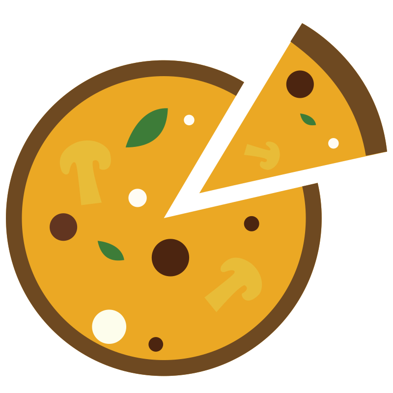
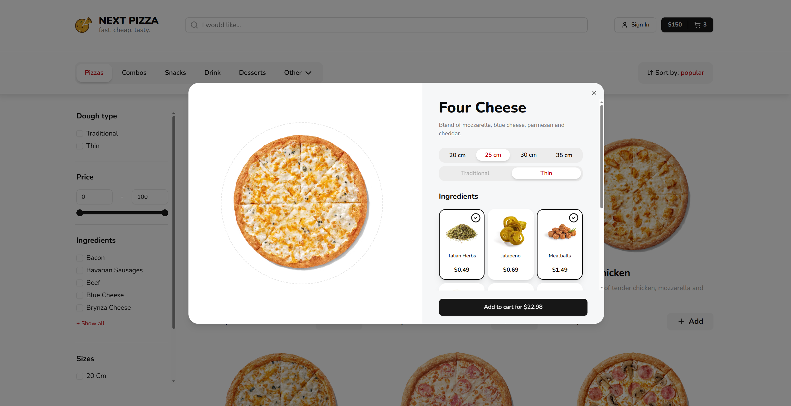

<!-- PROJECT LOGO -->
 

  

<h3 align="center">Pizza Store</h3>
  

    An interactive pizza ordering platform that allows users to build custom pizzas by choosing dough, size, and ingredients. Users can filter, sort, and search products, add items to the cart, order without signing in, and pay through a real payment provider, with SSR ensuring instant product display and modal product views for a seamless experience.
     
     
    <a href="https://pizza-umber-five.vercel.app">View Demo</a>
    &middot;
    <a href="https://github.com/woxer77/pizza/issues/new?labels=bug&template=bug-report---.md">Report Bug</a>
    &middot;
    <a href="https://github.com/woxer77/pizza/issues/new?labels=enhancement&template=feature-request---.md">Request Feature</a>
  

<!-- TABLE OF CONTENTS -->

  
Table of Contents

  <ol>
    <li><a href="#about-the-project">About The Project</a></li>
    <li><a href="#usage">Usage</a></li>
    <li><a href="#roadmap">Roadmap</a></li>
    <li><a href="#contact">Contact</a></li>
  </ol>

<!-- ABOUT THE PROJECT -->

## About The Project

![Pizza Store Screen Shot][product-screenshot]

Pizza Store is a modern web platform designed to make ordering pizza convenient, interactive, and personalized. Users can build custom pizzas, choose dough, size, and ingredients, browse ready-made options, and complete orders quickly with or without an account.

**Key Features:**

- Interactive main page with instant product display using SSR, filters, sorting, and search for easy navigation between products.
- Custom pizza builder allowing users to select dough, size, and ingredients to create their own unique pizzas.
- Shopping cart with the ability to place orders without registration, or securely log in via NextAuth for a personalized experience.
- Real payment integration for seamless and secure checkout.
- Modal product views implemented with parallel routes for quick previews without leaving the page.
- Intuitive interface design focused on user experience, making browsing, selecting, and ordering pizzas fast and enjoyable.
- Fully responsive layout powered by TailwindCSS, ensuring a smooth experience across devices.

### Built With

- [![TypeScript][TypeScript.js]][TypeScript-url]
- [![Next.js][Next.js]][Next-url]
- [![Prisma][Prisma]][Prisma-url]
- [![TailwindCSS][TailwindCSS]][Tailwind-url]
- [![shadcn-ui][shadcn-ui]][shadcn-ui-url]
- [![NextAuth][NextAuth]][NextAuth-url]
- [![Zustand][Zustand]][Zustand-url]

(<a href="#readme-top">back to top</a>)

<!-- USAGE EXAMPLES -->

## Usage

### 1. Open the Website

<a href="https://pizza-umber-five.vercel.app">Visit the platform</a> in your browser.

### 2. Choose a Pizza or Product

Browse the available pizzas and select one you like.

- Click on the pizza card to open a modal window and create a custom pizza.

### 3. Build a Custom Pizza

In the modal (or dedicated page), customize your pizza by selecting:

- **Dough type:** Traditional or Thin
- **Size:** 20, 25, 30, or 35 cm
- **Additional ingredients:** Choose any toppings you like

Once satisfied, add the pizza to your cart.

### 4. Manage Your Cart

Open the sidebar of the cart by clicking on the corresponding button in the upper right corner of the main page (in the header).
Add the desired quantity of products and review your selections in the cart before proceeding to checkout.

### 5. Checkout and Payment

Fill in all required fields on the checkout page, including delivery and contact information.  
Click **Pay** to be redirected to the payment provider. Confirm your payment to complete the order.

### 6. Track Your Order

After payment, you can view the status of your order on the corresponding page to see updates until it is delivered.

(<a href="#readme-top">back to top</a>)

<!-- ROADMAP -->

## Roadmap

- [x] Next.js parallel routes modal
- [x] Orders for unauthorized guests
- [ ] Create admin dashboard
- [ ] Add different images for each pizza size
- [ ] Implement user profile with order history and re-order option

(<a href="#readme-top">back to top</a>)

<!-- CONTACT -->

## Contact

Denis Ohrimenko - woxer77@gmail.com

Project Link: [https://github.com/woxer77/pizza](https://github.com/woxer77/pizza)

(<a href="#readme-top">back to top</a>)

<!-- MARKDOWN LINKS & IMAGES -->
<!-- https://www.markdownguide.org/basic-syntax/#reference-style-links -->

[product-screenshot]: public/main-page.png
[TypeScript.js]: https://img.shields.io/badge/TypeScript-007ACC?style=for-the-badge&logo=typescript&logoColor=white
[TypeScript-url]: https://www.typescriptlang.org/
[Next.js]: https://img.shields.io/badge/Next.js-000000?style=for-the-badge&logo=next.js&logoColor=white
[Next-url]: https://nextjs.org/
[Prisma]: https://img.shields.io/badge/Prisma-0C344B?style=for-the-badge&logo=prisma&logoColor=white
[Prisma-url]: https://www.prisma.io/
[TailwindCSS]: https://img.shields.io/badge/TailwindCSS-06B6D4?style=for-the-badge&logo=tailwind-css&logoColor=white
[Tailwind-url]: https://tailwindcss.com/
[NextAuth]: https://img.shields.io/badge/NextAuth-000000?style=for-the-badge&logo=nextauth.js&logoColor=white
[NextAuth-url]: https://next-auth.js.org/
[Zustand]: https://img.shields.io/badge/Zustand-000000?style=for-the-badge&logo=zustand&logoColor=white
[Zustand-url]: https://zustand-demo.pmnd.rs/
[shadcn-ui]: https://img.shields.io/badge/shadcn--ui-000000?style=for-the-badge&logo=figma&logoColor=white
[shadcn-ui-url]: https://ui.shadcn.com/
